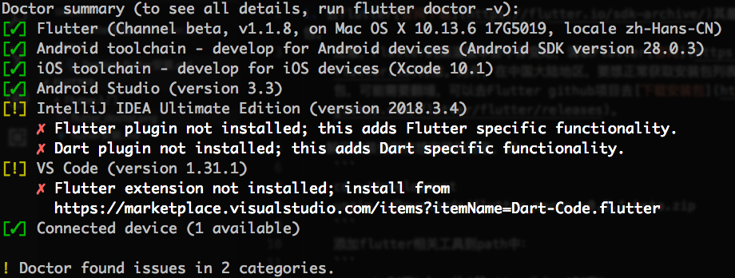

## Flutter环境配置

### 获取Flutter SDK  

1. 去flutter[官网下载](https://flutter.io/sdk-archive/)其最新可用的安装包    

    注意，Flutter的渠道版本会不停变动，请以Flutter[官网](https://flutter.io)为准。另外，在中国大陆地区，要想正常获取安装包列表或下载安装包，可能需要翻墙，可以去Flutter github项目去[下载安装包](https://github.com/flutter/flutter/releases)。

2. 解压安装包到你想安装的目录  

    ```bash
    cd ~/development
    unzip ~/Downloads/flutter_macos_v0.5.1-beta.zip
    ```
    添加flutter相关工具到path中：  
    ```bash
    export PATH=`pwd`/flutter/bin:$PATH
    ```
    > 此代码只能暂时针对当前命令行窗口设置PATH环境变量，要想永久将Flutter添加到PATH中需要调整系统环境变量。

### 配置flutter环境  

1. 运行 flutter doctor  

    运行以下命令查看是否需要安装其它依赖项来完成安装：  
    
    ```bash
    flutter doctor
    ```

    该命令检查您的环境并在终端窗口中显示报告。Dart SDK已经在捆绑在Flutter里了，没有必要单独安装Dart。 仔细检查命令行输出以获取可能需要安装的其他软件或进一步需要执行的任务（以粗体显示），运行效果如下： 

2. 编辑器设置  

    使用 flutter 命令行工具，您可以使用任何编辑器来开发Flutter应用程序。输入flutter help在提示符下查看可用的工具。  

3. 平台设置  

    Windows、Linux仅支持为Android开发Flutter应用程序，macOS支持为iOS和Android开发Flutter应用程序。需要完成iOS和Android两个平台中至少一个平台的开发环境。  

4. 配置编辑器  
    * Android Studio或（IntelliJ IDEA2017.1或更高版本）安装：  

        Flutter插件：支持Flutter开发工作流 (运行、调试、热重载等)。  

        Dart插件：提供代码分析 (输入代码时进行验证、代码补全等)。

    * Visual Studio Code (VS Code)（1.20.1或更高版本） 安装： 
        * 启动 VS Code
        * 调用 View>Command Palette…
        * 输入 ‘install’, 然后选择 Extensions: Install Extension action
        * 在搜索框输入 flutter , 在搜索结果列表中选择 ‘Flutter’, 然后点击 Install
        * 选择 ‘OK’ 重新启动 VS Code 