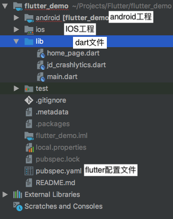
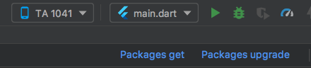

# 编写第一个 Flutter App

## 创建APP

可以选择使用 Android Studio / idea 或者从命令行运行。此示例使用的是Android Studio。

1. 选择 File>New Flutter Project
2. 选择 Flutter application 作为 project 类型, 然后点击 Next
3. 输入项目名称 (如 myapp), 然后点击 Next
4. 点击 Finish
5. 等待Android Studio安装SDK并创建项目.

目录结构如图：  


## flutter 入门解析

1. dart文件

    ```dart
    import 'package:flutter/material.dart';//导入包

    void main() => runApp(new MyApp());/程序入口(参照Dart语言基础)

    // flutter 应用的 Widget （参照flutter 控件）
    class MyApp extends StatelessWidget {
		@override
		Widget build(BuildContext context) {
			return new MaterialApp(
			title: 'Welcome to Flutter',
			home: new Scaffold(
				appBar: new AppBar(
				title: new Text('Welcome to Flutter'),
				),
				body: new Center(
				child: new Text('Hello World'),
				),
			),
			);
		}
    }
    ```

2. pubspec.yaml文件

```yaml
    name: flutter_demo # flutter的包名
    description: A new Flutter application.

    # The following defines the version and build number for your application.
    # A version number is three numbers separated by dots, like 1.2.43
    # followed by an optional build number separated by a +.
    # Both the version and the builder number may be overridden in flutter
    # build by specifying --build-name and --build-number, respectively.
    # Read more about versioning at semver.org.
    version: 1.0.0+1 # 版本号和build号

    environment:
    sdk: ">=2.1.0 <3.0.0" #flutter环境

    dependencies:  #依赖项，支持添加git连接
        flutter:
            sdk: flutter 

    # The following adds the Cupertino Icons font to your application.
    # Use with the CupertinoIcons class for iOS style icons.
        cupertino_icons: ^0.1.2

    dev_dependencies:  # dev依赖
        flutter_test:
            sdk: flutter


    # For information on the generic Dart part of this file, see the
    # following page: https://www.dartlang.org/tools/pub/pubspec

    # The following section is specific to Flutter.
    flutter: # flutter 配置

        # The following line ensures that the Material Icons font is
        # included with your application, so that you can use the icons in
        # the material Icons class.
        uses-material-design: true

        # To add assets to your application, add an assets section, like this:
        # assets:
        #  - images/a_dot_burr.jpeg
        #  - images/a_dot_ham.jpeg

        # An image asset can refer to one or more resolution-specific "variants", see
        # https://flutter.io/assets-and-images/#resolution-aware.

        # For details regarding adding assets from package dependencies, see
        # https://flutter.io/assets-and-images/#from-packages

        # To add custom fonts to your application, add a fonts section here,
        # in this "flutter" section. Each entry in this list should have a
        # "family" key with the font family name, and a "fonts" key with a
        # list giving the asset and other descriptors for the font. For
        # example:
        # fonts:
        #   - family: Schyler
        #     fonts:
        #       - asset: fonts/Schyler-Regular.ttf
        #       - asset: fonts/Schyler-Italic.ttf
        #         style: italic
        #   - family: Trajan Pro
        #     fonts:
        #       - asset: fonts/TrajanPro.ttf
        #       - asset: fonts/TrajanPro_Bold.ttf
        #         weight: 700
        #
        # For details regarding fonts from package dependencies,
        # see https://flutter.io/custom-fonts/#from-packages
```

## Flutter运行

1. 定位到Android Studio 工具栏:  

2. 点击 Packages get / Packages upgrade 来获取或升级依赖
3. 点击 run 运行 Flutter 应用

## 体验热重载

Flutter 可以通过 热重载（hot reload） 实现快速的开发周期，热重载就是无需重启应用程序就能实时加载修改后的代码，并且不会丢失状态（译者语:如果是一个web开发者，那么可以认为这和webpack的热重载是一样的）。简单的对代码进行更改，然后告诉IDE或命令行工具你需要重新加载（点击reload按钮），你就会在你的设备或模拟器上看到更改。

1. 将字符串`'You have pushed the button this many times:'` 更改为 `'You have clicked the button this many times:'`

2. 不要按“Stop”按钮; 让您的应用继续运行。

3. 要查看您的更改, 只需调用 Save All (cmd-s / ctrl-s), 或点击 热重载按钮 (带有闪电⚡️图标的按钮)。